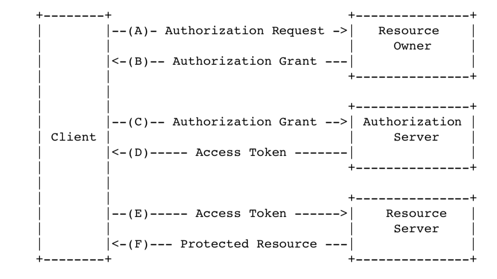

1.2

图1 抽象协议流程  

---

图1中的抽象 OAuth 2.0 流程 描述了4种角色之间的交互，包含以下步骤：  
（A） 客户端向资源所有者请求授权。    
  可以直接请求资源所有者授权，更好的方式是通过授权服务器中转间接授权。  
（B）客户端接收到授权许可（表示资源所有者授权的凭据）是用本标准定义的四种许可类型之一或扩展的许可类型。  
授权许可类型依赖客户端请求的授权类型及授权服务器支持情况。  
（C）客户端使用授权许可请求授权服务器颁发访问令牌。  
（D）授权服务器版验证客户端及授权许可，有效则颁发访问令牌。  
（E）客户端使用访问令牌访问资源服务器上受保护的资源。  
（F）资源服务器验证 访问令牌，有效则处理访问请求。  
客户端从资源所有者获取授权许可时（步骤(A) 及（B)中所述）更好的方式是通过授权服务器中转如4.1章 图 3所述。
