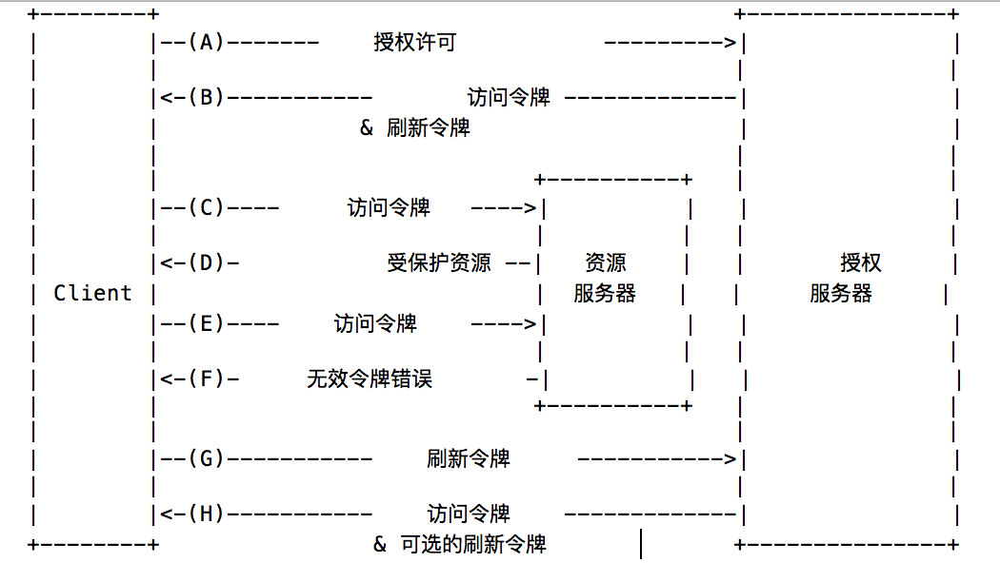

刷新令牌用于重新获取访问令牌。
当前访问令牌要过期或失效之前，刷新令牌使用授权服务器颁发给客户端的刷新令牌获取新的访问令牌。
或者使用刷新令牌获取新的访问令牌，新访问令牌访问范围不能大于当前令牌的范围（新访问令牌可能有效期更短或权限更少）。
授权服务器自行决定是否颁发刷新令牌。
如果授权服务器颁发刷新令牌，需要与访问令牌同时颁发（见 图1步骤（D））。
刷新令牌是一串字符，表示资源所有者给客户端的授权。
这串字符客户端一般不需要理解。
令牌是获取授权信息的标示符。
不像访问令牌，刷新令牌只用于授权服务器，不会发给资源服务器。

   图2: 刷新过期的访问令牌
图2所示流程包括下列步骤：
(A) 客户端用授权服务器颁发的授权许可获取访问令牌。
(B) 授权服务器认证客户端验证授权许可，有效的话颁发访问令牌及刷新令牌。
(C) 客户端用访问令牌访问保护资源。
(D) 资源服务器验证访问令牌，有效的话处理访问请求。
(E) 步骤 (C) 及 (D) 循环直到访问令牌过期。
如果客户端知道访问令牌过期，跳到步骤(G)；否则可继续访问保护资源。
(F) 访问令牌无效后，资源服务器返回“无效令牌错误”。
(G) 客户端使用刷新令牌向授权服务器请求访问令牌。
客户端身份验证要求基于客户端类型和授权服务器策略。
(H) 授权服务器认证客户端并验证刷新令牌，如果有效则颁发新的访问令牌（同时可选颁发新的刷新令牌）
步骤(C) 、(D)、（E) 及 (F) 如第7章所述不在本标准范围内。
